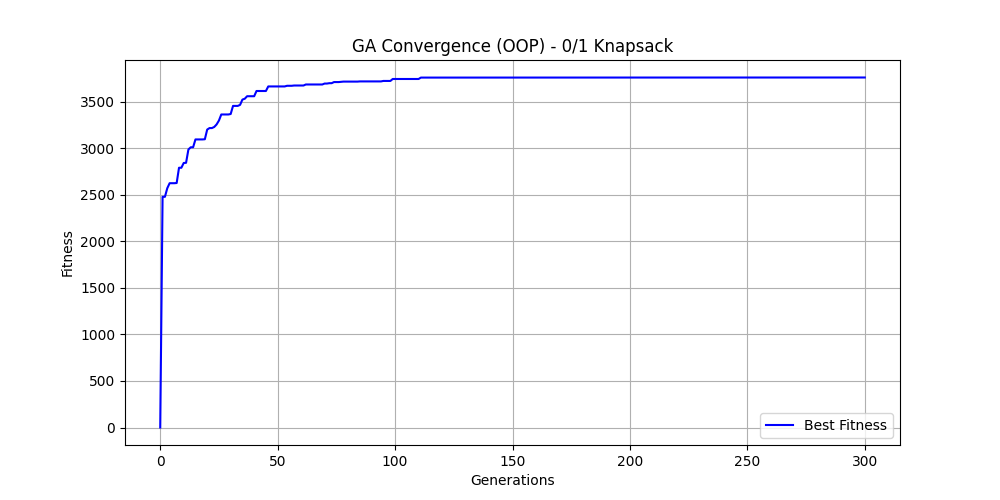
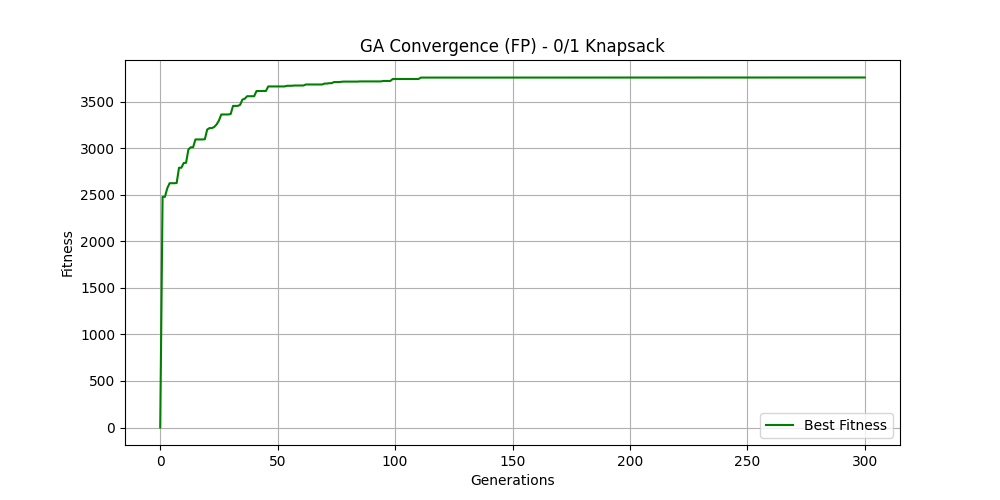

# **[Extended Assignment]** Genetic Algorithm (GA) — Object-Oriented vs Functional Programming

**Instructor:** Nguyen Thanh Cong, PhD

**Student Name:** Huynh Gia Bao

**Student ID:** 2410233

## 1. Project Overview

This project is an extended major assignment exploring the implementation of a Genetic Algorithm (GA) through two distinct software engineering paradigms: **Object-Oriented Programming (OOP)** and **Functional Programming (FP)**.

The primary objective is to evaluate the trade-offs between mutability and immutability, statefulness and pure functions, and execution speed versus code safety. To demonstrate the robustness and extensibility of the architecture, the GA is applied to three distinct optimization problems, ranging from classical computer science puzzles to practical machine learning applications.

## 2. Implemented Optimization Problems

1. **OneMax Problem:** The baseline test. A pure discrete optimization task aiming to maximize the number of `1`s in a binary chromosome of length `L=100`.
2. **0/1 Knapsack Problem:** A constrained combinatorial optimization problem. The GA must maximize the total value of items without exceeding a strict weight capacity (`n=100`).
3. **Feature Selection with L0 Regularization (Bonus - Extensible Design):** Applying GA to the Machine Learning domain. The algorithm determines the optimal subset of features to maximize Information Gain (derived from a trained ensemble model) while actively minimizing complexity through an L0 Regularization penalty. This encourages sparse, highly efficient predictive pipelines.

## 3. Installation & Execution

### Prerequisites

- Python 3.8+
- `matplotlib` (for generating evolution curves)


```bash
pip install -r requirements.txt
```
### Running the Experiments
Both paradigms utilize identical hyperparameter constraints (Population: 100, Generations: 300, Mutation Rate: 1/L) controlled via fixed random seeds for fair comparison.

To execute the Object-Oriented pipeline:
```bash
python oop/run.py
```
To execute the Functional Programming pipeline:
```bash
python fp/run.py
```

_Note: Execution will automatically generate fitness evolution plots (*oop.png and *fp.png) to prevent file overwriting, alongside detailed performance logs (.json) in the reports/ directory._

### Running Unit Tests
The project features strict test coverage for selection, crossover, mutation, and generational improvement.
```bash
python -m unittest discover -s oop/tests -t oop
python -m unittest discover -s fp/tests -t fp
```
## 4. Reflection: OOP vs. FP Trade-offs
Transitioning the GA engine between OOP and FP paradigms revealed significant architectural and computational trade-offs, perfectly reflecting the empirical runtime logs:

- **Object-Oriented Programming (OOP):** The OOP implementation utilizes the Strategy Pattern to decouple genetic operators from the core engine. Modeling biological processes natively aligns with OOP; a `Chromosome` object "mutates" by altering its internal state in place. Because Python lists are mutable, in-place bit-flipping involves negligible memory allocation overhead. This resulted in superior raw execution speed. However, state mutability introduces risk: strict encapsulation (using `@property` and `setters`) is mandatorily required to manually invalidate and reset the cached `_fitness` whenever a chromosome's genes are altered, otherwise, the algorithm will suffer from stale state bugs.

- **Functional Programming (FP):** The FP pipeline discards classes and mutable states, relying strictly on pure functions (`map`, `reduce`, `filter`), closures, and immutable `tuples`. Generational evolution is achieved by recursively folding states rather than via iterative `for` loops. While this design inherently eliminates side-effects—making the codebase robust and natively thread-safe for distributed computing—it introduces a noticeable performance penalty. Python's garbage collection struggles with the continuous memory allocation required to instantiate entirely new tuples for thousands of offspring in every generation, causing the FP execution time to be noticeably slower than OOP.

<p align="center">
  
  
</p>
<p align="center">
  <em>Comparison of knapsack problem: OOP vs Functional Programming</em>
</p>

Ultimately, OOP proved computationally superior for the raw iterative speed required by localized heuristic searches, whereas FP enforced a highly scalable, safe, and side-effect-free data transformation architecture.
## 5. Extra design: GA in Feature Selection
In the realm of machine learning, training an algorithm with hundreds of features often leads to the curse of dimensionality, increased computational cost, and severe overfitting. While traditional filter methods often rank and select the "Top K" features statically, they often ignore feature synergy and the overall model complexity.

By successfully extending the architecture to solve the Feature Selection problem, this project demonstrates a highly advanced, practical pipeline:
1. Leveraging Real-world Signals (Random Forest): Instead of assigning arbitrary weights to features, the practical implementation employs a RandomForestClassifier to pre-evaluate the dataset. By fitting the data through an ensemble of decision trees, the model extracts the feature_importances_ array, grounded in Gini impurity reduction.
2. Handling Exponential Search Spaces: Selecting an optimal subset from 100 features yields $2^{100}$ possible combinations. Exhaustive search is computationally impossible. GA acts as a directed global search mechanism, effortlessly navigating this discrete binary space.
3. Balancing Fitness and Complexity (L0 Penalty): The true power of the GA lies in its customized objective function. The fitness function calculates the dot product of the binary chromosome and the Random Forest importance scores (Information Gain). Crucially, it subtracts a penalty for every feature included (L0 Regularization). The GA must autonomously weigh the trade-off: it learns to drop a feature if its predictive contribution is too marginal to justify the added complexity penalty.

Consequently, pairing a pre-trained Random Forest for signal extraction with a Genetic Algorithm for subset optimization creates a formidable mechanism for producing sparse, highly efficient predictive pipelines
